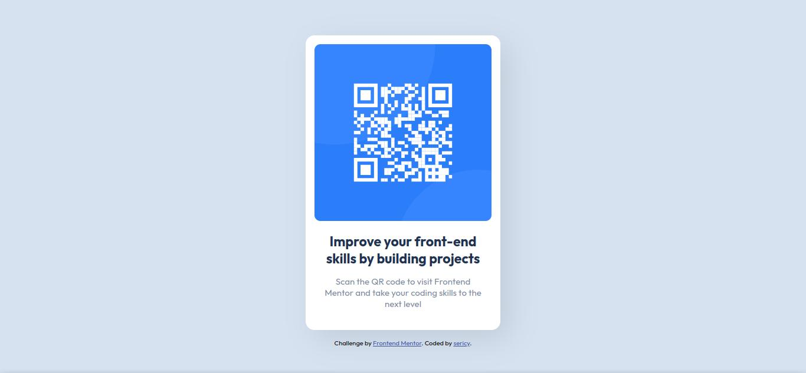

# Frontend Mentor - QR code component solution

This is a solution to the [QR code component challenge on Frontend Mentor](https://www.frontendmentor.io/challenges/qr-code-component-iux_sIO_H). Frontend Mentor challenges help you improve your coding skills by building realistic projects.

## Table of contents

- [Overview](#overview)
  - [Screenshot](#screenshot)
  - [Links](#links)
- [My process](#my-process)
  - [Built with](#built-with)
  - [What I learned](#what-i-learned)
  - [Continued development](#continued-development)
  - [Useful resources](#useful-resources)
- [Author](#author)

## Overview

### Screenshot

### Links

- Solution URL: [QR Code](https://samuel-eric.github.io/frontendmentor-qr-code/)

## My process

### Built with

- Semantic HTML5 markup
- CSS

### What I learned

Through this prohect I learnt the basics of CSS and HTML, and applied them to this project

### Continued development

I want to learn more about css flexbox and css grid and redone this project using those technology.

### Useful resources

- [w3schools CSS Box Shadow Property](https://www.w3schools.com/cssref/css3_pr_box-shadow.asp) - I haven't learnt about box shadow, so this article really helped me learn.

## Author

- sericy
- Frontend Mentor - [@samuel-eric](https://www.frontendmentor.io/profile/yourusername)
